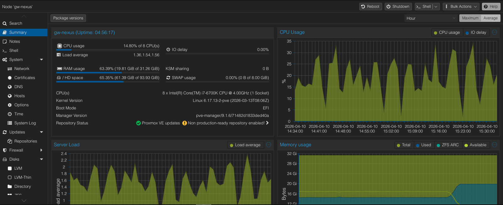
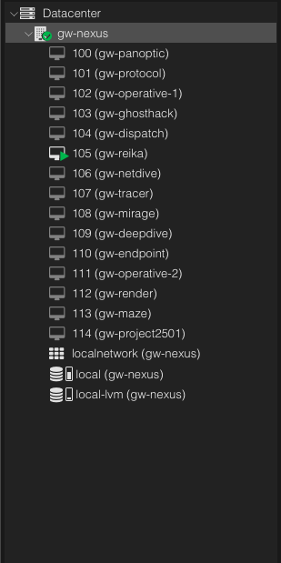

# Phase 1 — Lab Architecture

## Overview

Virtualized IT support lab built on Proxmox VE, simulating a small business environment. Infrastructure includes an Active Directory domain, domain-joined workstations, a help desk ticketing system, and a SIEM for log monitoring.

---

## Hypervisor

| Item | Details |
|------|---------|
| Platform | [Proxmox VE 8.x](https://www.proxmox.com/en/proxmox-virtual-environment/overview) |
| Host | gw-nexus (192.168.1.50) |
| RAM | 32 GB |
| Storage | SSD pool — thin provisioned |
| Total VMs | 15 across 4 network zones |

---


*gw-nexus — Proxmox node summary showing host resources and VM list*

---

## Lab VM Inventory

| VM | Role | OS | vCPU | RAM | Network |
|----|------|----|------|-----|---------|
| gw-protocol | Domain Controller, DNS, DHCP | Windows Server | 2 | 4 GB | vmbr2 — 10.10.20.0/24 |
| gw-operative-1 | Primary domain workstation | Windows 11 Pro | 2 | 4 GB | vmbr2 — 10.10.20.0/24 |
| gw-operative-2 | Secondary domain workstation | Windows 10 Pro | 2 | 4 GB | vmbr2 — 10.10.20.0/24 |
| gw-dispatch | ITSM / help desk ([GLPI](https://glpi-project.org/)) | Ubuntu Linux | 2 | 4 GB | vmbr1 — 10.10.10.0/24 |
| gw-panoptic | SIEM / log monitoring ([Wazuh](https://wazuh.com/)) | Ubuntu Linux | 4 | 8 GB | vmbr1 — 10.10.10.0/24 |
| gw-tracer | Network diagnostics | Linux | 2 | 2 GB | vmbr2 — 10.10.20.0/24 |
| gw-endpoint | Linux endpoint / hardening | Ubuntu Server | 2 | 2 GB | vmbr2 — 10.10.20.0/24 |

---


*Proxmox VM list — lab VMs across vmbr1 and vmbr2 network segments*

---

## Snapshot Policy

Snapshots are taken before any major configuration change using the following naming convention:

```
VMNAME-pre-PHASE-DESCRIPTION
Example: gw-protocol-pre-phase4-ad-install
```

---

## Phase Roadmap

| Phase | Focus Area |
|-------|-----------|
| 1 | Lab planning and architecture |
| 2 | Proxmox validation and network configuration |
| 3 | Windows workstation support |
| 4 | Active Directory, DNS, DHCP |
| 5 | Domain join, users, groups, permissions |
| 6 | Group Policy and workstation management |
| 7 | Network troubleshooting |
| 8 | Remote support tools |
| 9 | GLPI help desk ticketing |
| 10 | Software deployment and troubleshooting |
| 11 | Log analysis, Event Viewer, Wazuh SIEM |
| 12 | Capstone support scenarios |
| 13 | GitHub publishing and resume finalization |
