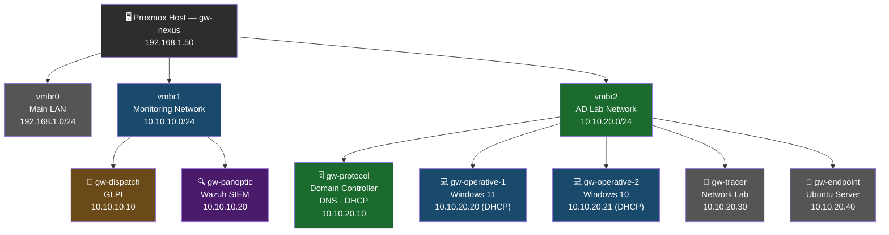
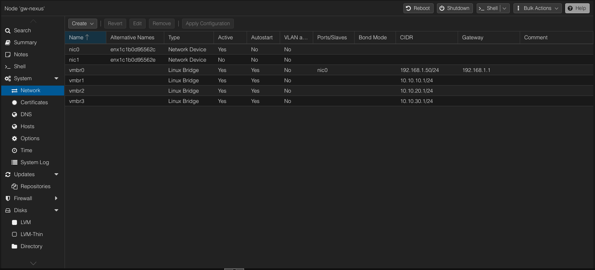

# Network Design

## Topology

---

*Proxmox network configuration — vmbr0, vmbr1, vmbr2 bridges*

---

## Network Segments

| Bridge | Subnet | Purpose |
|--------|--------|---------|
| vmbr0 | 192.168.1.0/24 | Main LAN — physical host management |
| vmbr1 | 10.10.10.0/24 | Monitoring — SIEM and ticketing |
| vmbr2 | 10.10.20.0/24 | AD lab — domain controller and workstations |

---

## IP Address Plan

| VM | Bridge | IP | Assignment |
|----|--------|----|-----------|
| gw-protocol | vmbr2 | 10.10.20.10 | Static |
| gw-operative-1 | vmbr2 | 10.10.20.20 | DHCP reservation |
| gw-operative-2 | vmbr2 | 10.10.20.21 | DHCP reservation |
| gw-tracer | vmbr2 | 10.10.20.30 | Static |
| gw-endpoint | vmbr2 | 10.10.20.40 | Static |
| gw-dispatch | vmbr1 | 10.10.10.10 | Static |
| gw-panoptic | vmbr1 | 10.10.10.20 | Static |
| DHCP pool | vmbr2 | 10.10.20.100–200 | Dynamic |

---

## DHCP Configuration (gw-protocol)

| Setting | Value |
|---------|-------|
| Scope | Lab-Workstations |
| Network | 10.10.20.0/24 |
| Range | 10.10.20.100 – 10.10.20.200 |
| Subnet mask | 255.255.255.0 |
| Default gateway | 10.10.20.1 |
| DNS server | 10.10.20.10 |
| Lease time | 8 hours |

*DHCP scope configuration on gw-protocol*

---

## DNS Configuration (gw-protocol)

| Zone | Type | Purpose |
|------|------|---------|
| lab.local | Forward lookup | Hostname to IP resolution |
| 20.10.10.in-addr.arpa | Reverse lookup | IP to hostname resolution |

*DNS Manager — lab.local forward lookup zone*
