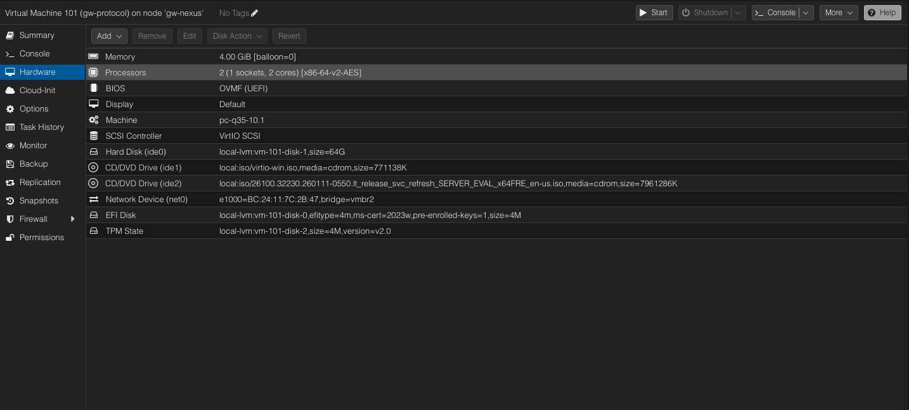

# VM Inventory

---

## gw-protocol — Domain Controller

| Setting | Value |
|---------|-------|
| VM ID | 101 |
| Role | Domain Controller, DNS Server, DHCP Server |
| OS | Windows Server |
| vCPU | 2 |
| RAM | 4 GB |
| Disk | 64 GB |
| Network | vmbr2 — 10.10.20.0/24 |
| IP | 10.10.20.10 (static) |
| Domain | lab.local |

*gw-protocol hardware configuration in Proxmox*

---

## gw-operative-1 — Primary Workstation

| Setting | Value |
|---------|-------|
| VM ID | 102 |
| Role | Domain workstation — primary support target |
| OS | Windows 11 Pro |
| vCPU | 2 |
| RAM | 4 GB |
| Disk | 60 GB |
| Network | vmbr2 — 10.10.20.0/24 |
| IP | DHCP from gw-protocol |

*gw-operative-1 — domain joined to lab.local*

---

## gw-operative-2 — Secondary Workstation

| Setting | Value |
|---------|-------|
| VM ID | 111 |
| Role | Domain workstation — secondary support target |
| OS | Windows 10 Pro |
| vCPU | 2 |
| RAM | 4 GB |
| Disk | 60 GB |
| Network | vmbr2 — 10.10.20.0/24 |
| IP | DHCP from gw-protocol |

*gw-operative-2 — second domain endpoint*

---

## gw-dispatch — Help Desk Ticketing (GLPI)

| Setting | Value |
|---------|-------|
| VM ID | 104 |
| Role | ITSM / help desk ticketing |
| Software | [GLPI](https://glpi-project.org/) |
| OS | Ubuntu Linux |
| vCPU | 2 |
| RAM | 4 GB |
| Disk | 40 GB |
| Network | vmbr1 (10.10.10.0/24) + vmbr0 (192.168.1.0/24) |
| IP | 10.10.10.10 (static) |

*GLPI help desk interface on gw-dispatch*

---

## gw-panoptic — SIEM (Wazuh)

| Setting | Value |
|---------|-------|
| VM ID | 100 |
| Role | SIEM and log monitoring |
| Software | [Wazuh](https://wazuh.com/) |
| OS | Ubuntu Linux |
| vCPU | 4 |
| RAM | 8 GB |
| Disk | 40 GB |
| Network | vmbr1 (10.10.10.0/24) + vmbr0 (192.168.1.0/24) |
| IP | 10.10.10.20 (static) |

*Wazuh SIEM dashboard — connected agents and security alerts*

---

## gw-tracer — Network Lab

| Setting | Value |
|---------|-------|
| VM ID | 107 |
| Role | Network diagnostics and packet analysis |
| OS | Linux |
| vCPU | 2 |
| RAM | 2 GB |
| Disk | 52 GB |
| Network | vmbr2 — 10.10.20.0/24 |
| IP | 10.10.20.30 (static) |

*Wireshark packet capture on the lab network*

---

## gw-endpoint — Linux Endpoint

| Setting | Value |
|---------|-------|
| VM ID | 110 |
| Role | Linux admin target, Wazuh agent, hardening |
| OS | Ubuntu Server |
| vCPU | 2 |
| RAM | 2 GB |
| Disk | 32 GB |
| Network | vmbr2 — 10.10.20.0/24 |
| IP | 10.10.20.40 (static) |

---

## Resource Summary

| VM | vCPU | RAM | Disk |
|----|------|-----|------|
| gw-protocol | 2 | 4 GB | 64 GB |
| gw-operative-1 | 2 | 4 GB | 60 GB |
| gw-operative-2 | 2 | 4 GB | 60 GB |
| gw-dispatch | 2 | 4 GB | 40 GB |
| gw-panoptic | 4 | 8 GB | 40 GB |
| gw-tracer | 2 | 2 GB | 52 GB |
| gw-endpoint | 2 | 2 GB | 32 GB |
| **Total** | **16** | **28 GB** | **348 GB** |
