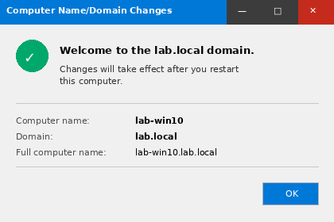
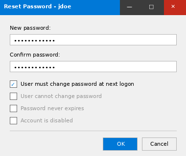
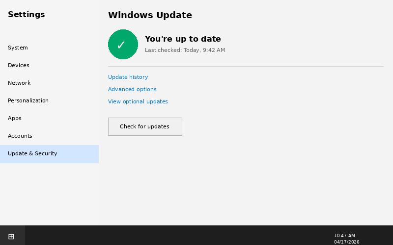
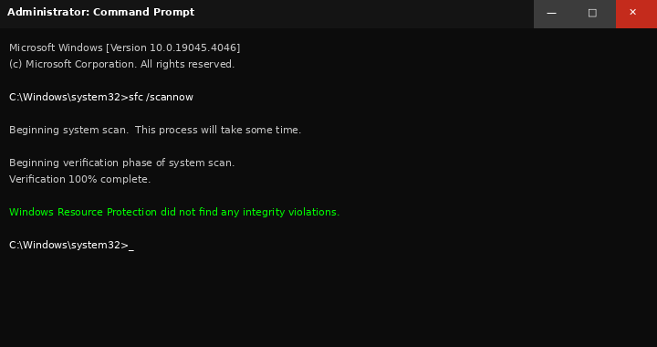
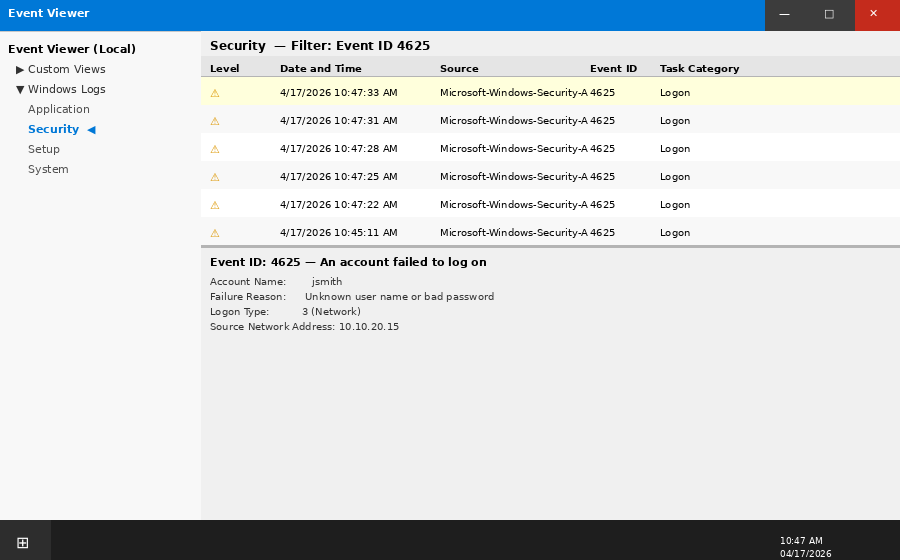

# Phase 3 — Windows Workstation Support

## Objective

Simulate common end-user support scenarios on domain-joined Windows workstations. Practice OS-level troubleshooting, account management, and system diagnostics using standard IT support tools.

---

## Environment

| VM | Role | OS |
|----|------|----|
| lab-win10 | Primary support target | Windows 10 Pro 22H2 |
| lab-win11 | Secondary support target | Windows 11 Pro 23H2 |
| lab-dc01 | Domain controller | Windows Server 2022 |

---

## Tasks Completed

- [x] Domain join both workstations to `lab.local`
- [x] Verified DNS resolution to lab-dc01
- [x] Local account management (create, disable, reset)
- [x] Windows Update — policy-driven via GPO, verified compliance
- [x] Disk cleanup and system health check
- [x] Event Viewer — identify login failures and application errors
- [x] Safe Mode diagnostics walkthrough
- [x] Driver issue simulation and Device Manager resolution

---

## Domain Join — lab-win10

Joined `lab-win10` to the `lab.local` domain via **System Properties → Change**.

**DNS prerequisite:** Workstation DNS must point to the DC before join succeeds.

```
Preferred DNS: 10.10.20.10  (lab-dc01)
Alternate DNS: (blank)
```


*lab-win10 successfully joined to lab.local — welcome prompt from the domain*

Post-join: logged in with domain credentials `lab\helpdesk.user` to verify group policy application.

---

## Domain Join — lab-win11

Same procedure on `lab-win11`. Verified with:

```powershell
systeminfo | findstr /B /C:"Domain"
# Domain: lab.local
```


---

## Local Account Management

### Create a local admin account (break-glass)

```powershell
New-LocalUser -Name "lab-local-admin" -Password (ConvertTo-SecureString "P@ssw0rd123!" -AsPlainText -Force) -FullName "Local Admin" -Description "Break-glass local admin"
Add-LocalGroupMember -Group "Administrators" -Member "lab-local-admin"
```

### Disable a user account (simulated leaver)

```powershell
Disable-LocalUser -Name "jdoe.local"
```

### Reset a domain user password (from lab-dc01)

```powershell
Set-ADAccountPassword -Identity "jdoe" -Reset -NewPassword (ConvertTo-SecureString "NewP@ss2024!" -AsPlainText -Force)
Set-ADUser -Identity "jdoe" -ChangePasswordAtLogon $true
```


*ADUC password reset — force change at next logon checked*

---

## Windows Update

Verified Windows Update policy applied via GPO (Phase 6). Manually triggered update check on `lab-win10`:

```powershell
UsoClient StartScan
UsoClient StartDownload
UsoClient StartInstall
```


*lab-win10 — fully patched, last check timestamp confirmed*

---

## Disk Cleanup and System Health

```cmd
# Disk cleanup (silent, all categories)
cleanmgr /sagerun:1

# Check file system integrity
sfc /scannow

# DISM image health
DISM /Online /Cleanup-Image /CheckHealth
DISM /Online /Cleanup-Image /ScanHealth
```

**sfc output (lab-win10):**
```
Windows Resource Protection did not find any integrity violations.
```



---

## Event Viewer — Login Failures

Filtered Security log for Event ID 4625 (failed logon):

```
Event ID: 4625
Account Name: jsmith
Failure Reason: Unknown user name or bad password
Logon Type: 3 (Network)
Source IP: 10.10.20.15
```


*Security log — failed logon events filtered by Event ID 4625*

**Resolution:** Confirmed account was locked after 5 attempts (Fine-Grained Password Policy). Unlocked via ADUC and notified user.

---

## Troubleshooting Notes

| Issue | Root Cause | Resolution |
|-------|-----------|------------|
| Domain join failed | DNS pointing to router, not DC | Set DNS to 10.10.20.10 before join |
| GPO not applying | Machine not in correct OU | Moved computer object to `Lab Workstations` OU |
| Profile load error | Temp profile on login | Deleted corrupt profile folder under C:\Users |
| Windows Update stuck | BITS service stopped | `net start bits` — service was set to Disabled |

---

## Skills Demonstrated

- Domain join (GUI and PowerShell)
- Local and domain account lifecycle management
- Windows Update troubleshooting
- System file integrity checks (sfc, DISM)
- Event Viewer log filtering (Security, Application, System)
- Safe Mode boot and driver troubleshooting
