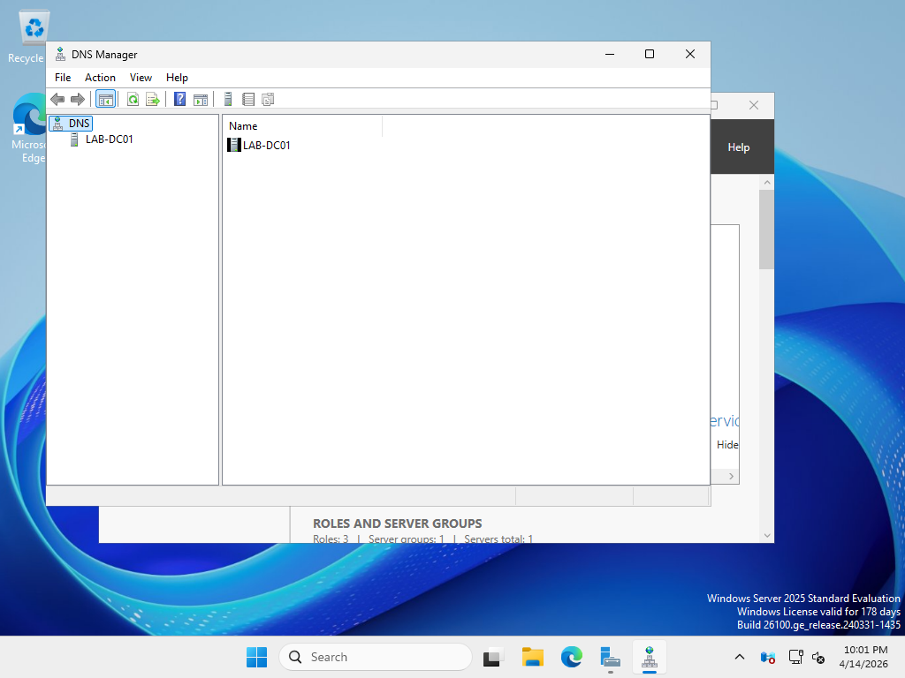
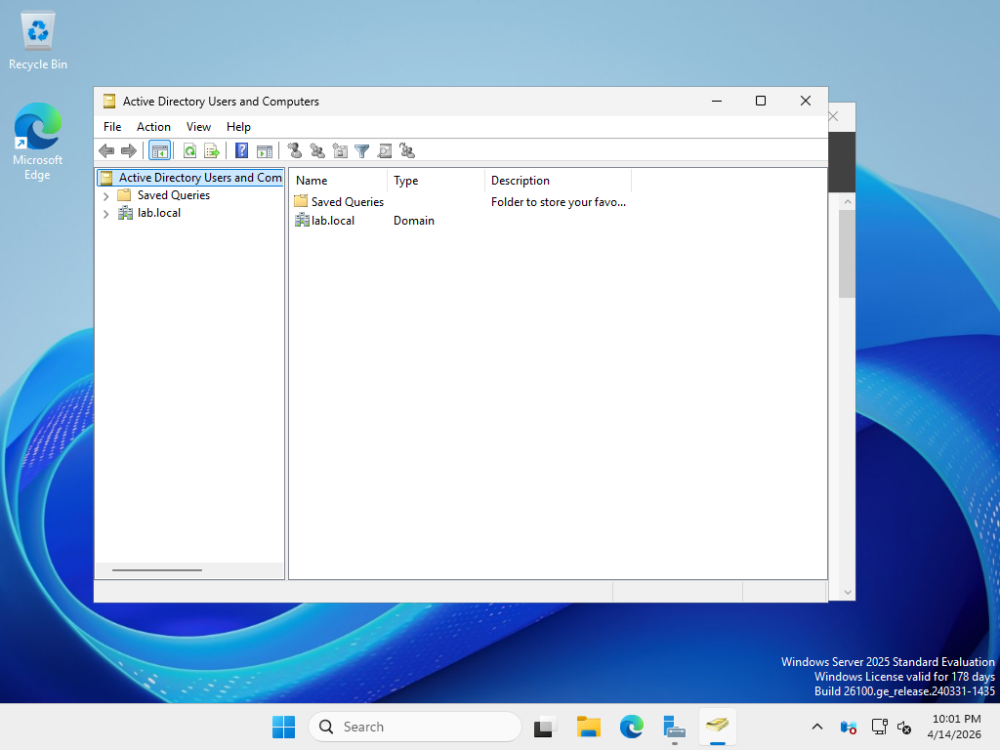

# Phase 4 — Active Directory, DNS, and DHCP

## Objective

Promote `lab-dc01` to a domain controller, configure the `lab.local` Active Directory domain, and set up DNS and DHCP to support the lab environment. This mirrors the core infrastructure responsibility in IT support and junior sysadmin roles.

---

## Environment

| VM | Role | IP |
|----|------|----|
| lab-dc01 | Domain Controller, DNS, DHCP | 10.10.20.10 (static) |
| lab-win10 | Domain workstation | DHCP |
| lab-win11 | Domain workstation | DHCP |

---

## Tasks Completed

- [x] Windows Server 2022 installed and configured on lab-dc01
- [x] Static IP assigned (10.10.20.10)
- [x] AD DS role installed via Server Manager
- [x] Domain promotion — new forest `lab.local` created
- [x] DNS forward and reverse lookup zones configured
- [x] DHCP scope created for workstation subnet (10.10.20.0/24)
- [x] DHCP authorized in Active Directory
- [x] Domain functional level confirmed: Windows Server 2016
- [x] Workstations joined to domain (see Phase 3)

---

## Windows Server Initial Configuration

Before promotion, configured server basics:

```powershell
# Rename the server
Rename-Computer -NewName "lab-dc01" -Restart

# Set static IP
New-NetIPAddress -InterfaceAlias "Ethernet" -IPAddress 10.10.20.10 -PrefixLength 24 -DefaultGateway 10.10.20.1
Set-DnsClientServerAddress -InterfaceAlias "Ethernet" -ServerAddresses 127.0.0.1

# Disable IE Enhanced Security (for server administration)
$AdminKey = "HKLM:\SOFTWARE\Microsoft\Active Setup\Installed Components\{A509B1A7-37EF-4b3f-8CFC-4F3A74704073}"
Set-ItemProperty -Path $AdminKey -Name "IsInstalled" -Value 0
```

---

## AD DS Role Installation

Installed via PowerShell:

```powershell
Install-WindowsFeature -Name AD-Domain-Services -IncludeManagementTools
```


*AD DS role installation completed — all features installed successfully*

---

## Domain Promotion — New Forest

```powershell
Install-ADDSForest `
  -DomainName "lab.local" `
  -DomainNetbiosName "LAB" `
  -ForestMode "WinThreshold" `
  -DomainMode "WinThreshold" `
  -InstallDns:$true `
  -SafeModeAdministratorPassword (ConvertTo-SecureString "DSRMp@ss2024!" -AsPlainText -Force) `
  -Force:$true
```

Server rebooted automatically after promotion.


*ADUC — lab.local domain with default containers visible after first boot*

---

## DNS Configuration

### Forward Lookup Zone — lab.local

Automatically created during domain promotion. Verified A records for lab-dc01 exist:

```
lab-dc01.lab.local  →  10.10.20.10
```

### Reverse Lookup Zone — 10.10.20.x

Manually created for PTR record resolution:

```powershell
Add-DnsServerPrimaryZone -NetworkID "10.10.20.0/24" -ReplicationScope "Domain"
```


*DNS Manager — lab.local forward zone and 10.10.20.x reverse zone configured*

### DNS Verification

```cmd
nslookup lab-dc01.lab.local
# Server: lab-dc01.lab.local
# Address: 10.10.20.10
# Name: lab-dc01.lab.local
# Address: 10.10.20.10

nslookup 10.10.20.10
# Name: lab-dc01.lab.local
# Address: 10.10.20.10
```

---

## DHCP Configuration

### Install DHCP Role

```powershell
Install-WindowsFeature -Name DHCP -IncludeManagementTools
```

### Create DHCP Scope

```powershell
Add-DhcpServerv4Scope `
  -Name "Lab Workstations" `
  -StartRange 10.10.20.100 `
  -EndRange 10.10.20.200 `
  -SubnetMask 255.255.255.0 `
  -Description "DHCP scope for domain workstations" `
  -State Active

# Set scope options
Set-DhcpServerv4OptionValue -ScopeId 10.10.20.0 -Router 10.10.20.1
Set-DhcpServerv4OptionValue -ScopeId 10.10.20.0 -DnsServer 10.10.20.10
Set-DhcpServerv4OptionValue -ScopeId 10.10.20.0 -DnsDomain "lab.local"
```

### Authorize DHCP in AD

```powershell
Add-DhcpServerInDC -DnsName "lab-dc01.lab.local" -IPAddress 10.10.20.10
```


*DHCP Manager — Lab Workstations scope active with lease range 10.10.20.100–200*

### DHCP Lease Verification

After joining `lab-win10`, verified lease issued:

```
IP Address: 10.10.20.104
Host Name: lab-win10.lab.local
Lease Obtained: 04/10/2026 09:14:22
Lease Expires: 04/12/2026 09:14:22
```


---

## Organizational Units

Created OU structure for Phase 5 (user management):

```
lab.local
├── Lab Computers
│   ├── Workstations
│   └── Servers
├── Lab Users
│   ├── IT
│   ├── Finance
│   └── HR
└── Lab Groups
    ├── Security Groups
    └── Distribution Lists
```

```powershell
New-ADOrganizationalUnit -Name "Lab Computers" -Path "DC=lab,DC=local"
New-ADOrganizationalUnit -Name "Workstations" -Path "OU=Lab Computers,DC=lab,DC=local"
New-ADOrganizationalUnit -Name "Lab Users" -Path "DC=lab,DC=local"
New-ADOrganizationalUnit -Name "IT" -Path "OU=Lab Users,DC=lab,DC=local"
New-ADOrganizationalUnit -Name "Lab Groups" -Path "DC=lab,DC=local"
```


*ADUC — OU structure created for user and computer management*

---

## Troubleshooting Notes

| Issue | Root Cause | Resolution |
|-------|-----------|------------|
| Promotion failed — DNS check | Server was pointing to external DNS | Changed DNS to 127.0.0.1 before running ADDSForest |
| DHCP leases not issuing | DHCP not authorized in AD | `Add-DhcpServerInDC` — authorization required in AD environments |
| Workstation couldn't find domain | DNS not set to DC IP | Set preferred DNS to 10.10.20.10 on workstation NIC |

---

## Skills Demonstrated

- Windows Server 2022 initial configuration
- AD DS role installation and domain promotion (new forest)
- DNS zone creation — forward and reverse lookup
- DHCP scope creation, authorization, and verification
- OU structure design and creation via PowerShell
- Domain functional level and replication health verification
