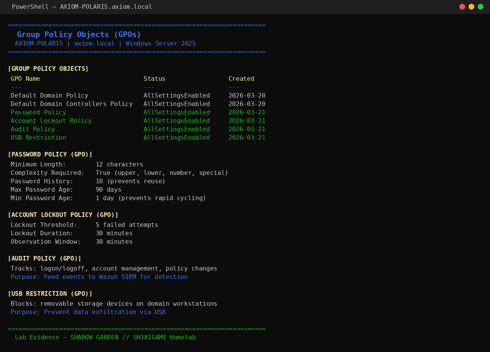

# Phase 6 — Group Policy

## Objective

Create and apply Group Policy Objects (GPOs) to enforce workstation configuration, security baselines, and software settings across the lab domain. GPO management is a core skill for IT support, sysadmin, and help desk roles in Active Directory environments.

---

## Tasks Completed

- [x] Default Domain Policy reviewed (not modified — best practice)
- [x] Workstation baseline GPO created and linked to Workstations OU
- [x] Password policy GPO applied at domain level
- [x] Windows Update GPO — force updates via WSUS redirect (simulated)
- [x] Desktop wallpaper and lock screen policy deployed
- [x] USB storage restriction GPO created
- [x] Drive mapping GPO — map department shares on login
- [x] Software restriction baseline (block cmd.exe for standard users)
- [x] GPO application verified with `gpresult` and `rsop`

---

## GPO Strategy

| GPO Name | Linked To | Purpose |
|----------|-----------|---------|
| Domain-Password-Policy | lab.local | Domain-wide password requirements |
| Workstation-Baseline | OU=Workstations | Security baseline for all workstations |
| Drive-Mapping-IT | OU=IT | Map \\lab-dc01\IT on login |
| Drive-Mapping-Finance | OU=Finance | Map \\lab-dc01\Finance on login |
| Drive-Mapping-HR | OU=HR | Map \\lab-dc01\HR on login |
| USB-Restriction | OU=Workstations | Block removable storage |
| Wallpaper-Policy | OU=Workstations | Enforce corporate wallpaper |

---

## Domain Password Policy GPO

Configured at domain root to enforce baseline password requirements:

```
Minimum password length: 12 characters
Password history:        10 passwords
Maximum password age:    90 days
Minimum password age:    1 day
Complexity:              Enabled
Reversible encryption:   Disabled
Account lockout:         5 attempts / 15 min observation / 30 min lockout
```

**Path:** `Computer Configuration → Policies → Windows Settings → Security Settings → Account Policies`

---

## Workstation Baseline GPO

### Security Settings Applied

```
Interactive logon: Display last user name = Disabled
Interactive logon: Require CTRL+ALT+DEL = Enabled
Screen saver:      Enabled, 10 min, require password on resume
Audit policy:      Logon events (Success + Failure), Account management (Success)
```

### Windows Update Settings

```
Configure Automatic Updates:    Enabled — Auto download and schedule install
Scheduled install day:          Every day
Scheduled install time:         03:00
No auto-restart with logged-on users: Enabled
```


*Group Policy Editor — Automatic Updates policy configured on Workstation-Baseline GPO*

---

## USB Storage Restriction

Prevents users from using removable USB storage on workstations.

**Path:** `Computer Configuration → Policies → Administrative Templates → System → Removable Storage Access`

```
Removable Disks: Deny read access  = Enabled
Removable Disks: Deny write access = Enabled
```


*USB restriction — read and write access denied for removable disks via GPO*

**Verification on lab-win10:**

```
gpupdate /force
```

Inserted USB drive — Windows displayed "Access Denied" and the drive did not mount.


---

## Drive Mapping GPO (User Configuration)

Mapped department shares using Group Policy Preferences.

**Path:** `User Configuration → Preferences → Windows Settings → Drive Maps`

```
Finance share:
  Action:       Create
  Location:     \\lab-dc01\Finance
  Drive Letter: F:
  Item-Level Targeting: Security Group = Finance-Staff

IT share:
  Action:       Create
  Location:     \\lab-dc01\IT
  Drive Letter: I:
  Item-Level Targeting: Security Group = IT-Staff
```


*Drive mapping via GPO Preferences — Finance share maps F: only for Finance-Staff members*

**Verification:** Logged into `lab-win10` as `dwilson` (Finance) — F: drive mapped automatically.

---

## Wallpaper Policy

```
Path:  Computer Configuration → Administrative Templates → Desktop → Desktop
Setting: Desktop Wallpaper → Enabled
Wallpaper Path: \\lab-dc01\SYSVOL\lab.local\Policies\wallpaper.jpg
Wallpaper Style: Fill
```


*Workstation wallpaper enforced via GPO — user cannot change desktop background*

---

## GPO Verification

### gpresult — Applied GPOs

Run on `lab-win10` as domain admin:

```cmd
gpresult /r /scope computer
```

```
Applied Group Policy Objects
-----------------------------
    Workstation-Baseline
    Domain-Password-Policy
    Default Domain Policy
```

```cmd
gpresult /r /scope user
```

```
Applied Group Policy Objects
-----------------------------
    Drive-Mapping-Finance  (for dwilson)
    USB-Restriction
    Wallpaper-Policy
    Default Domain Users Policy
```


### rsop.msc

Ran Resultant Set of Policy on `lab-win10` for user `dwilson` — confirmed Finance drive map present and USB restriction active.

---

## Troubleshooting Notes

| Issue | Root Cause | Resolution |
|-------|-----------|------------|
| GPO not applying | Computer in wrong OU | Moved from default Computers container to Workstations OU |
| Drive not mapping for Finance user | Item-level targeting — group membership not refreshed | `gpupdate /force` + log off/on |
| Wallpaper reverting | User had local admin rights, could override | Removed user from local Administrators group |
| USB policy not enforcing | GPO linked at domain level, not Workstations OU | Moved link to correct OU with higher precedence |

---

## Skills Demonstrated

- GPO creation, linking, and OU targeting
- Security baseline enforcement (lockout, audit, screen lock)
- Windows Update management via Group Policy
- Removable storage restriction
- Drive mapping with item-level targeting via GPO Preferences
- GPO verification with `gpresult` and `rsop.msc`
- GPO troubleshooting — scope, OU placement, inheritance
