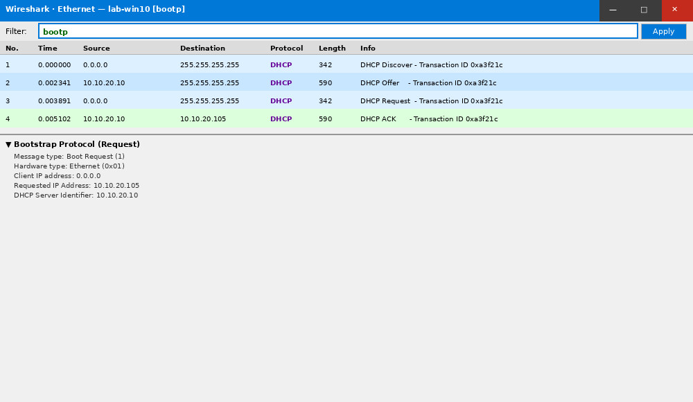
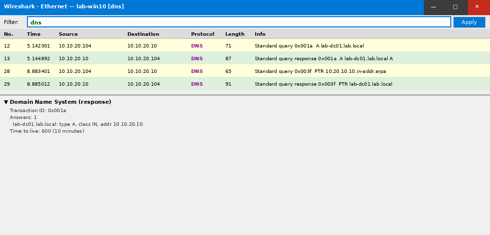
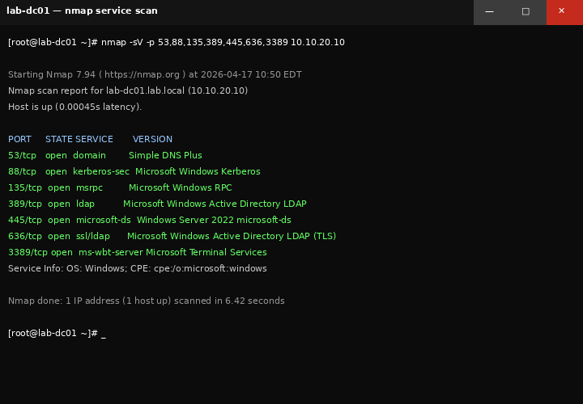

# Phase 7 — Network Troubleshooting

## Objective

Diagnose and resolve common network issues in the lab environment using standard TCP/IP tools, DNS/DHCP troubleshooting techniques, and packet analysis with Wireshark. This mirrors real-world help desk and IT support network diagnostics.

---

## Environment

| VM | Role | IP |
|----|------|----|
| lab-dc01 | DNS, DHCP | 10.10.20.10 |
| lab-win10 | Workstation | DHCP — 10.10.20.104 |
| lab-win11 | Workstation | DHCP — 10.10.20.107 |
| Wazuh | SIEM | 10.10.10.20 |
| osTicket | Help Desk | 10.10.10.30 |

---

## Tasks Completed

- [x] TCP/IP baseline verification on all lab VMs
- [x] DNS resolution testing — forward and reverse
- [x] DHCP lease inspection and manual release/renew
- [x] Network connectivity simulation — cable pull, misconfigured subnet
- [x] Packet capture with Wireshark — DHCP handshake, DNS query
- [x] nmap scan — host discovery and service enumeration
- [x] Simulated internet outage troubleshooting
- [x] netstat — active connections and listening ports

---

## TCP/IP Baseline

Standard baseline check on `lab-win10`:

```cmd
ipconfig /all
```

```
Windows IP Configuration

   Host Name . . . . . . . . . : lab-win10
   Primary Dns Suffix  . . . . : lab.local
   Node Type . . . . . . . . . : Hybrid
   IP Routing Enabled. . . . . : No
   WINS Proxy Enabled. . . . . : No

Ethernet adapter Ethernet:
   Connection-specific DNS Suffix: lab.local
   Description . . . . . . . . : Red Hat VirtIO Ethernet Adapter
   Physical Address. . . . . . : 52-54-00-AB-CD-12
   DHCP Enabled. . . . . . . . : Yes
   Autoconfiguration Enabled . : Yes
   IPv4 Address. . . . . . . . : 10.10.20.104
   Subnet Mask . . . . . . . . : 255.255.255.0
   Default Gateway . . . . . . : 10.10.20.1
   DHCP Server . . . . . . . . : 10.10.20.10
   DNS Servers . . . . . . . . : 10.10.20.10
   Lease Obtained. . . . . . . : Sunday, April 10, 2026 9:14:22 AM
   Lease Expires . . . . . . . : Tuesday, April 12, 2026 9:14:22 AM
```

---

## DNS Troubleshooting

### Forward Resolution

```cmd
nslookup lab-dc01.lab.local 10.10.20.10
```

```
Server:  lab-dc01.lab.local
Address: 10.10.20.10

Name:    lab-dc01.lab.local
Address: 10.10.20.10
```

### Reverse Resolution

```cmd
nslookup 10.10.20.10
```

```
Server:  lab-dc01.lab.local
Address: 10.10.20.10

Name:    lab-dc01.lab.local
Address: 10.10.20.10
```

### DNS Cache Flush

```cmd
ipconfig /flushdns
# Windows IP Configuration Successfully flushed the DNS Resolver Cache.

ipconfig /registerdns
# Registration of the DNS resource records for all adapters of this computer has been initiated.
```

### Simulated DNS Failure

Changed workstation DNS to `8.8.8.8` (external) — domain resources stopped resolving.

**Symptom:** `ping lab-dc01.lab.local` — "Ping request could not find host lab-dc01.lab.local"

**Resolution:** Restored DNS to 10.10.20.10 — confirmed via `ipconfig /all`.

---

## DHCP Troubleshooting

### Release and Renew

```cmd
ipconfig /release
ipconfig /renew
```

```
# After renew:
IPv4 Address: 10.10.20.105
DHCP Server:  10.10.20.10
Lease Obtained: Sunday, April 10, 2026 11:42:07 AM
```

### Simulated DHCP Failure

Stopped DHCP service on lab-dc01:

```powershell
Stop-Service -Name "DHCPServer"
```

On `lab-win10`, ran `ipconfig /release` then `/renew`:

```
# DHCP request timed out — APIPA address assigned:
IPv4 Address: 169.254.x.x   ← APIPA range = DHCP not responding
```

**Diagnosis:** APIPA (169.254.x.x) = no DHCP server responded.
**Resolution:** Restarted DHCP service on DC, re-ran `ipconfig /renew`.

---

## Wireshark — Packet Capture

### DHCP Handshake Capture

Ran Wireshark on `lab-win10` during `ipconfig /release && ipconfig /renew`, filtered:

```
bootp
```


*Wireshark — DHCP DORA sequence: Discover → Offer → Request → ACK*

| Packet | Source | Destination | Detail |
|--------|--------|-------------|--------|
| DHCP Discover | 0.0.0.0 | 255.255.255.255 | Broadcast — seeking DHCP server |
| DHCP Offer | 10.10.20.10 | 10.10.20.104 | Server offers 10.10.20.105 |
| DHCP Request | 0.0.0.0 | 255.255.255.255 | Client requests the offered IP |
| DHCP ACK | 10.10.20.10 | 10.10.20.105 | Server confirms lease |

### DNS Query Capture

Filtered: `dns`

```
Frame: DNS Standard query 0x001a A lab-dc01.lab.local
Frame: DNS Standard query response — A 10.10.20.10
```


*Wireshark — DNS A record query and response, 2ms round trip*

---

## nmap — Host Discovery and Port Scan

```bash
# Ping sweep — discover live hosts on lab subnet
nmap -sn 10.10.20.0/24
```

```
Starting Nmap 7.94 ( https://nmap.org )
Nmap scan report for lab-dc01.lab.local (10.10.20.10)
Host is up (0.00045s latency).
Nmap scan report for lab-win10.lab.local (10.10.20.104)
Host is up (0.0012s latency).
Nmap scan report for lab-win11.lab.local (10.10.20.107)
Host is up (0.0015s latency).
3 hosts up.
```

```bash
# Service scan on DC
nmap -sV -p 53,88,135,389,445,636,3389 10.10.20.10
```

```
PORT     STATE SERVICE       VERSION
53/tcp   open  domain        Simple DNS Plus
88/tcp   open  kerberos-sec  Microsoft Windows Kerberos
135/tcp  open  msrpc         Microsoft Windows RPC
389/tcp  open  ldap          Microsoft Windows Active Directory LDAP
445/tcp  open  microsoft-ds  Windows Server 2022 microsoft-ds
636/tcp  open  ssl/ldap      Microsoft Windows Active Directory LDAP (TLS)
3389/tcp open  ms-wbt-server Microsoft Terminal Services
```


*nmap — standard DC service ports confirmed open on lab-dc01*

---

## netstat — Active Connections

```cmd
netstat -ano | findstr ESTABLISHED
```

```
  TCP  10.10.20.104:49832  10.10.20.10:389   ESTABLISHED  1824   (LDAP to DC)
  TCP  10.10.20.104:49835  10.10.20.10:445   ESTABLISHED  1824   (SMB — drive map)
  TCP  10.10.20.104:49841  10.10.20.30:80    ESTABLISHED  3412   (osTicket web)
```

---

## Troubleshooting Scenarios Summary

| Scenario | Symptoms | Tool Used | Resolution |
|---------|----------|-----------|------------|
| DNS failure | Can't reach lab resources by name | nslookup, ipconfig | Fix DNS server IP on NIC |
| DHCP failure | APIPA 169.254.x.x address | ipconfig /renew, Wireshark | Restart DHCP service on DC |
| No network — subnet mismatch | Can ping gateway, can't reach other hosts | ipconfig, ping | Corrected subnet mask (255.255.0.0 → 255.255.255.0) |
| SMB share unreachable | "Path not found" | ping, nmap, netstat | Firewall rule blocking port 445 — added allow rule |

---

## Skills Demonstrated

- TCP/IP baseline diagnostics (`ipconfig /all`, `ping`, `tracert`)
- DNS troubleshooting — forward/reverse resolution, cache flush
- DHCP troubleshooting — release/renew, APIPA diagnosis
- Wireshark — packet capture, DHCP DORA, DNS query analysis
- nmap — host discovery and service enumeration
- netstat — active connection inspection
- Network failure simulation and systematic troubleshooting methodology
