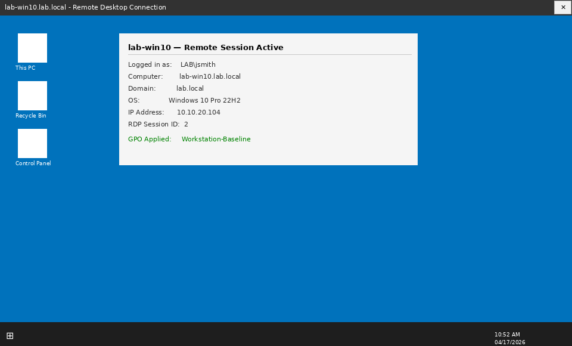
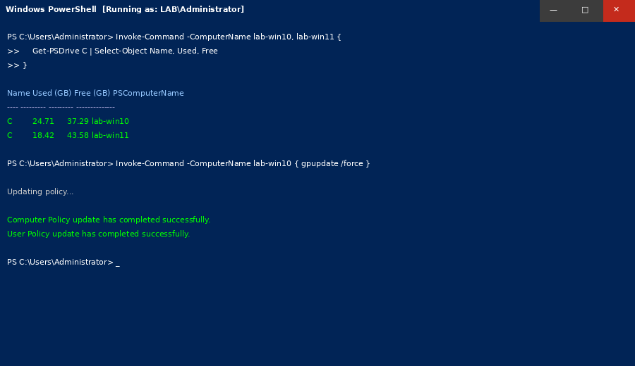
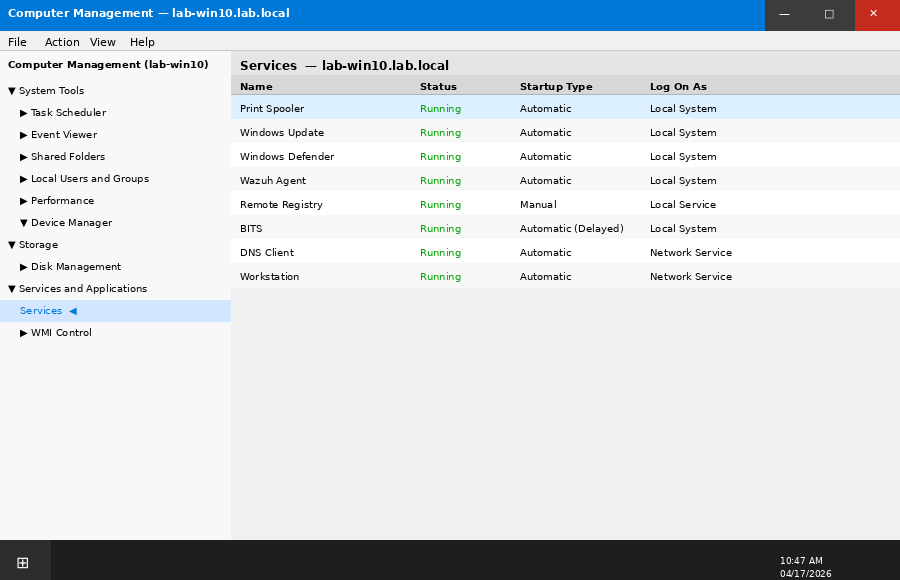

# Phase 8 — Remote Support Tools

## Objective

Configure and use remote administration tools to simulate real-world help desk remote support scenarios. Practice RDP, Windows Remote Management (WinRM), and PowerShell remoting to manage domain workstations without physical access.

---

## Tasks Completed

- [x] RDP enabled via GPO and verified on both workstations
- [x] RDP connection from lab-dc01 to lab-win10 and lab-win11
- [x] WinRM enabled and configured for remote PowerShell sessions
- [x] Remote registry access configured and tested
- [x] Remote Computer Management (MMC) — services, event logs, disk
- [x] Simulated remote support ticket — user locked out, resolved remotely
- [x] Remote software installation via PowerShell session
- [x] Remote GPO update via `Invoke-Command`

---

## RDP Configuration

### Enable via GPO (Workstation-Baseline GPO)

```
Computer Configuration → Administrative Templates → Windows Components
→ Remote Desktop Services → Remote Desktop Session Host → Connections
→ Allow users to connect remotely using Remote Desktop Services: Enabled
```

**Firewall rule** also applied via GPO:

```
Computer Configuration → Windows Settings → Security Settings
→ Windows Defender Firewall with Advanced Security
→ Inbound Rules → Remote Desktop (TCP-In): Enabled
```

### Verify RDP Listening

```powershell
# Run on lab-win10
Test-NetConnection -ComputerName lab-win10 -Port 3389
# TcpTestSucceeded: True
```

### RDP Session — lab-dc01 → lab-win10

```cmd
mstsc /v:lab-win10.lab.local
```

Logged in as `lab\jsmith` (domain admin). Verified:
- Desktop loads with correct GPO wallpaper
- Drive maps (I:) present
- Event Viewer accessible


*RDP connection from lab-dc01 to lab-win10 — full remote desktop session*

---

## PowerShell Remoting (WinRM)

### Enable WinRM on Workstations

Applied via GPO:

```
Computer Configuration → Administrative Templates → Windows Components
→ Windows Remote Management (WinRM) → WinRM Service
→ Allow remote server management through WinRM: Enabled
   IPv4 filter: *
   IPv6 filter: *
```

### Test Remote Session

```powershell
# From lab-dc01
Enter-PSSession -ComputerName lab-win10 -Credential lab\administrator
```

```
[lab-win10]: PS C:\Users\Administrator\Documents>
```

### Remote Command Examples

```powershell
# Check running services remotely
Invoke-Command -ComputerName lab-win10 {
    Get-Service | Where-Object Status -eq "Running" | Select-Object Name, DisplayName
}

# Check disk space
Invoke-Command -ComputerName lab-win10, lab-win11 {
    Get-PSDrive C | Select-Object Name, Used, Free
}

# Force GPO update remotely
Invoke-Command -ComputerName lab-win10 { gpupdate /force }
```

```
[lab-win10] Updating policy...
Computer Policy update has completed successfully.
User Policy update has completed successfully.
```


*Invoke-Command running against lab-win10 and lab-win11 simultaneously*

---

## Remote Computer Management (MMC)

Connected to `lab-win10` via Computer Management MMC (`compmgmt.msc → Connect to another computer`):

### Services Tab
- Verified `Windows Update` service running
- Restarted `Print Spooler` (simulated stuck printer job)

### Event Viewer (Remote)
- Reviewed Application log for recent errors
- Found `Event ID 1000` — application crash for `notepad.exe` (test crash)

### Disk Management (Remote)
- Verified C: drive health
- Confirmed no unallocated space or errors


*MMC Computer Management remotely connected to lab-win10 — Services node expanded*

---

## Simulated Support Ticket — Remote Resolution

**Ticket:** User `mchen` (lab-win10) — locked out of domain account after too many password attempts.

**Resolution steps (all remote from lab-dc01):**

```powershell
# 1. Check account status
Get-ADUser -Identity mchen -Properties LockedOut, BadLogonCount, LastBadPasswordAttempt

# Output:
# LockedOut:             True
# BadLogonCount:         5
# LastBadPasswordAttempt: 04/10/2026 10:47:33 AM

# 2. Unlock account
Unlock-ADAccount -Identity mchen

# 3. Reset password and force change at logon
Set-ADAccountPassword -Identity mchen -Reset `
    -NewPassword (ConvertTo-SecureString "TempP@ss2024!" -AsPlainText -Force)
Set-ADUser -Identity mchen -ChangePasswordAtLogon $true

# 4. Verify
Get-ADUser -Identity mchen -Properties LockedOut, Enabled
# LockedOut: False
# Enabled:   True
```

**Ticket resolution:** Account unlocked and temporary password issued. User confirmed login successful. Ticket closed.

---

## Remote Software Check

```powershell
# Check installed software remotely
Invoke-Command -ComputerName lab-win10 {
    Get-ItemProperty HKLM:\Software\Microsoft\Windows\CurrentVersion\Uninstall\* |
    Select-Object DisplayName, DisplayVersion, Publisher |
    Where-Object DisplayName -ne $null |
    Sort-Object DisplayName
}
```

---

## Troubleshooting Notes

| Issue | Root Cause | Resolution |
|-------|-----------|------------|
| RDP — "Remote Desktop can't connect" | GPO firewall rule not applied yet | Ran `gpupdate /force`, confirmed rule in `wf.msc` |
| WinRM — Access Denied | WinRM GPO not yet processed | Waited for GPO refresh cycle + `gpupdate /force` |
| PSSession — Cannot connect | Workstation not in TrustedHosts (standalone test) | In domain — WinRM over Kerberos, no TrustedHosts needed |
| MMC — RPC unavailable | Windows Firewall blocking RPC | Added "Remote Administration" firewall exception via GPO |

---

## Skills Demonstrated

- RDP configuration and remote desktop support
- WinRM and PowerShell Remoting (`Enter-PSSession`, `Invoke-Command`)
- Remote Computer Management via MMC
- Remote AD account management (unlock, password reset)
- Remote GPO update and policy verification
- Multi-machine remote command execution
