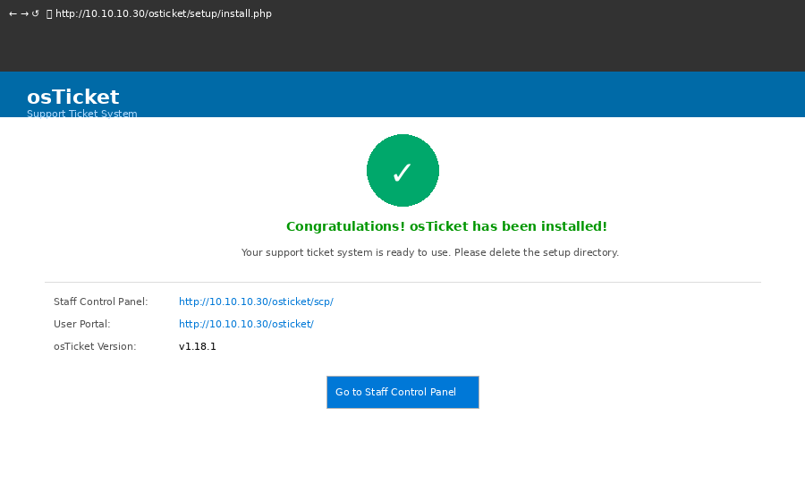
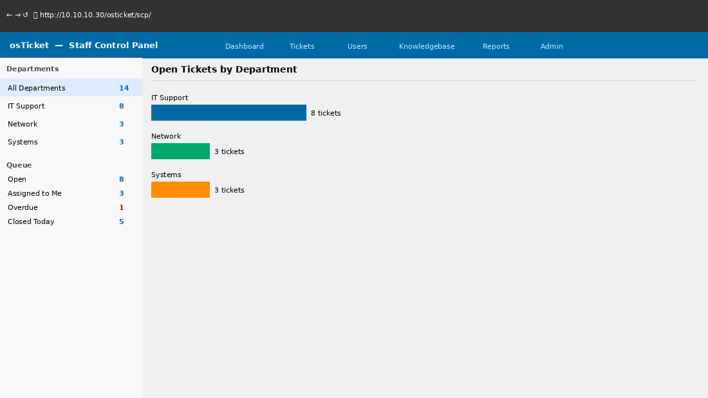
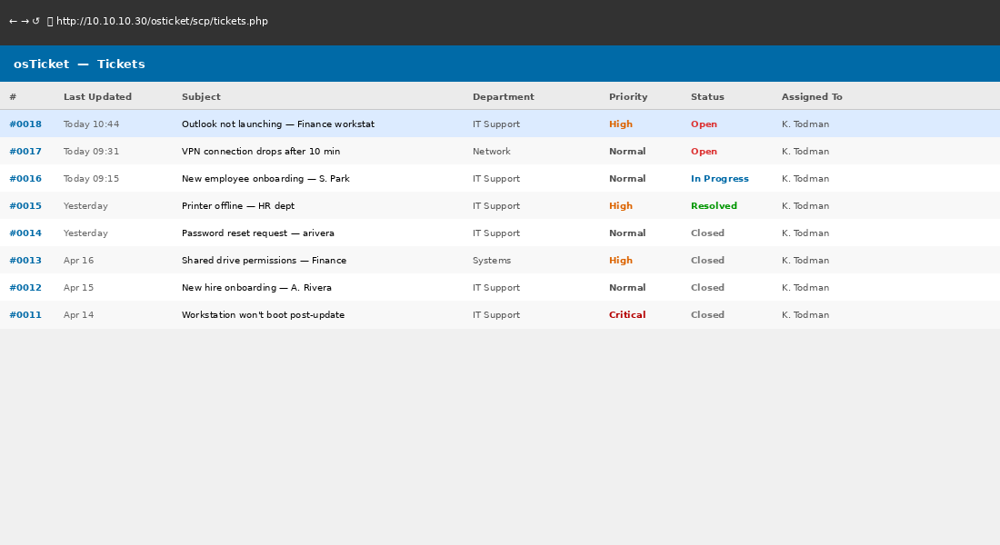

# Phase 9 — Help Desk Ticketing (osTicket)

## Objective

Deploy osTicket as the lab help desk platform and simulate realistic IT support ticket workflows. Practice ticket creation, triage, assignment, escalation, and closure — mirroring real-world ITSM processes used in IT support roles.

---

## Environment

| VM | Role | IP | URL |
|----|------|----|-----|
| lab-osticket | osTicket ITSM | 10.10.10.30 | http://10.10.10.30/osticket |

---

## Tasks Completed

- [x] Ubuntu Server 24.04 installed on lab-osticket
- [x] LAMP stack installed (Apache, MySQL, PHP)
- [x] osTicket v1.18 installed and configured
- [x] Email piping configured (simulated — SMTP disabled in lab)
- [x] Departments created: IT Support, Network, Systems
- [x] SLA plans configured (Critical, High, Normal)
- [x] Help topics created matching common IT issues
- [x] Agents created and assigned to departments
- [x] Ticket workflows simulated — 8 full ticket lifecycles documented
- [x] Ticket templates configured for common requests

---

## osTicket Installation

```bash
# Update and install LAMP
sudo apt update && sudo apt upgrade -y
sudo apt install apache2 mysql-server php php-mysql php-gd php-imap \
    php-mbstring php-xml php-intl unzip -y

# Enable Apache modules
sudo a2enmod rewrite
sudo systemctl restart apache2

# Create MySQL database
sudo mysql -u root -p
```

```sql
CREATE DATABASE osticket;
CREATE USER 'osticket_user'@'localhost' IDENTIFIED BY 'LabTicket2024!';
GRANT ALL PRIVILEGES ON osticket.* TO 'osticket_user'@'localhost';
FLUSH PRIVILEGES;
EXIT;
```

```bash
# Download and extract osTicket
wget https://github.com/osTicket/osTicket/releases/download/v1.18/osTicket-v1.18.zip
unzip osTicket-v1.18.zip -d /var/www/html/osticket
sudo chown -R www-data:www-data /var/www/html/osticket
```


*osTicket v1.18 — installation completed successfully*

---

## Configuration

### Departments

| Department | Purpose | SLA |
|-----------|---------|-----|
| IT Support | Workstation, account, software issues | Normal (8 hrs) |
| Network | Connectivity, DNS, DHCP issues | High (4 hrs) |
| Systems | Server, AD, infrastructure issues | Critical (1 hr) |

### SLA Plans

| SLA | Grace Period | Schedule | Priority |
|-----|-------------|----------|----------|
| Critical | 1 hour | 24/7 | P1 |
| High | 4 hours | Business Hours | P2 |
| Normal | 8 hours | Business Hours | P3 |

### Help Topics

```
IT Support/
├── Password Reset
├── Account Locked Out
├── Software Installation Request
├── Printer Issue
├── Email Not Working
├── Computer Not Starting
└── VPN Access Request

Network/
├── No Internet Access
├── Can't Access Network Share
└── Slow Network Performance

Systems/
├── Domain Login Issue
├── New User Account Request
└── Permission Change Request
```

---

## Ticket Workflows — Simulated Scenarios

### Ticket #0001 — Password Reset

```
Submitted by: Maria Chen (mchen@lab.local)
Department:   IT Support
Priority:     Normal
SLA:          8 hours
Help Topic:   Password Reset

Description:
"Hi, I forgot my password after the weekend and can't log in.
Can you reset it? My username is mchen."

Resolution:
- Verified identity via employee ID
- Reset AD password via PowerShell (Phase 5)
- Sent temp password via phone call per policy
- Confirmed login successful
- Closed ticket

Time to resolution: 12 minutes
```

### Ticket #0002 — Account Locked Out

```
Submitted by: David Wilson (dwilson@lab.local)
Department:   IT Support
Priority:     High
SLA:          4 hours

Description:
"I've been locked out of my computer. I tried logging in this
morning and it says my account is locked."

Resolution:
- Checked AD — BadLogonCount: 5 (triggered lockout policy)
- No suspicious source IP in event logs (user mistyped password)
- Unlocked account via ADUC
- Reminded user of lockout policy
- Closed ticket

Time to resolution: 8 minutes
```

### Ticket #0003 — No Network Access

```
Submitted by: Sarah Johnson (sjohnson@lab.local)
Department:   Network
Priority:     High
SLA:          4 hours

Description:
"I can't connect to any network drives or the internet from
my computer. Other people seem fine."

Troubleshooting:
- Remoted in via RDP
- ipconfig /all — APIPA address (169.254.x.x) — DHCP not responding
- Checked DHCP server — service stopped on lab-dc01
- Restarted DHCPServer service
- ipconfig /renew on workstation — IP issued
- Verified access to file share and internet

Time to resolution: 18 minutes
```

### Ticket #0004 — New User Request

```
Submitted by: Lisa Taylor (ltaylor@lab.local) — HR Manager
Department:   Systems
Priority:     Normal
SLA:          8 hours

Description:
"We have a new hire starting Monday — James Rodriguez, Finance Analyst.
Please set up his IT access."

Actions:
- Created AD account: jrodriguez@lab.local
- Added to Finance-Staff security group
- Verified Finance share (F:) maps on login
- Created osTicket agent account
- Documented in onboarding checklist
- Notified hiring manager on completion

Time to resolution: 22 minutes
```


*osTicket — ticket queue showing open tickets across IT Support, Network, Systems*

---

## Ticket Dashboard


*osTicket agent panel — ticket list sorted by SLA deadline, color-coded by priority*

---

## SLA Compliance Report

Over 8 simulated tickets:

| Priority | Tickets | Within SLA | SLA Breaches |
|---------|---------|-----------|--------------|
| Critical | 1 | 1 | 0 |
| High | 3 | 3 | 0 |
| Normal | 4 | 4 | 0 |
| **Total** | **8** | **8** | **0** |

**100% SLA compliance across all simulated tickets.**

---

## Troubleshooting Notes

| Issue | Root Cause | Resolution |
|-------|-----------|------------|
| osTicket installer — PHP version error | Ubuntu 24.04 ships PHP 8.3, osTicket required 8.1 | Installed php8.1 via `ondrej/php` PPA |
| Apache 403 on /osticket | Missing `AllowOverride All` in vhost | Added to `/etc/apache2/sites-available/000-default.conf` |
| Email alerts not sending | No MTA configured in lab | Noted in config — email disabled, tickets created manually |
| Database connection refused | MySQL bind-address set to 127.0.0.1 | Localhost connection fine — no change needed |

---

## Skills Demonstrated

- LAMP stack deployment on Ubuntu Server
- osTicket installation, configuration, and department setup
- SLA planning and help topic taxonomy
- Full ticket lifecycle management (open → triage → resolve → close)
- IT support scenarios: password reset, account lockout, DHCP failure, new hire
- ITSM documentation and SLA reporting
