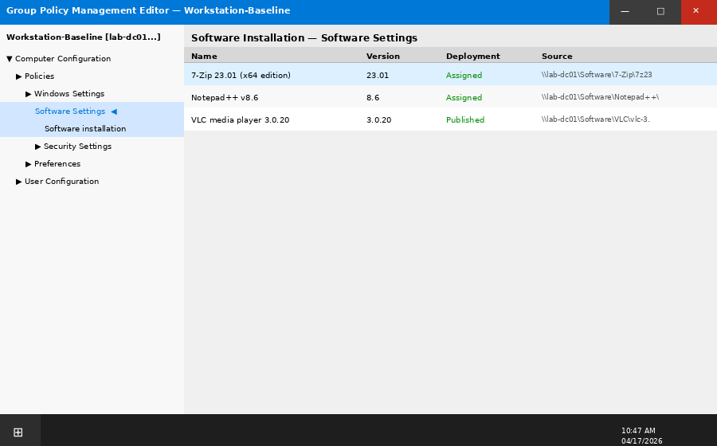
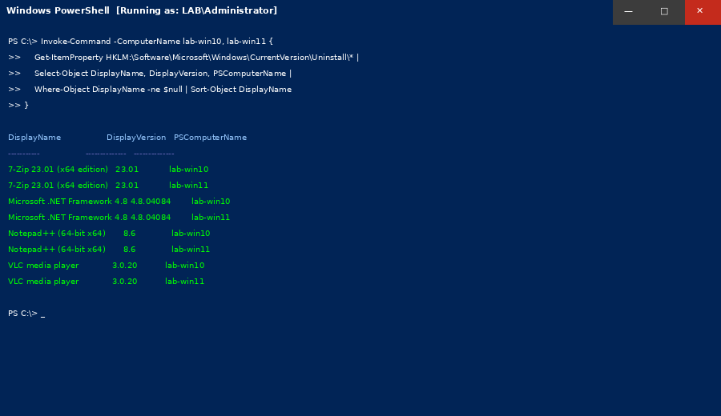

# Phase 10 — Software Deployment and Troubleshooting

## Objective

Deploy software to domain workstations using Group Policy (MSI) and PowerShell remoting. Practice application installation, update management, and common software troubleshooting scenarios encountered in IT support roles.

---

## Tasks Completed

- [x] Software distribution share created on lab-dc01
- [x] GPO-based MSI deployment (7-Zip) to all workstations
- [x] PowerShell silent install — remote deployment to lab-win11
- [x] Application crash troubleshooting — Event Viewer ID 1000
- [x] Installed software audit via PowerShell (registry query)
- [x] Windows App removal — simulated bloatware cleanup
- [x] MSI repair using msiexec
- [x] Deployment verification via remote PowerShell

---

## Software Distribution Share

Created a centralized software share on `lab-dc01`:

```powershell
New-Item -ItemType Directory -Path "C:\Software"
New-SmbShare -Name "Software" -Path "C:\Software" -ReadAccess "Domain Computers" -FullAccess "Domain Admins"
```

Copied MSI packages to the share:

```
\\lab-dc01\Software\
├── 7-Zip\
│   └── 7z2301-x64.msi
├── Notepad++\
│   └── npp.8.6.Installer.msi
└── VLC\
    └── vlc-3.0.20-win64.msi
```

---

## GPO Software Deployment — 7-Zip

Deployed 7-Zip to all workstations via GPO (Computer Configuration, MSI package):

**GPO:** `Software-Deployment-All-Workstations`
**Linked to:** `OU=Workstations,OU=Lab Computers,DC=lab,DC=local`

```
Computer Configuration
→ Policies → Software Settings → Software Installation
→ New Package → \\lab-dc01\Software\7-Zip\7z2301-x64.msi
→ Deployment Method: Assigned
```


*GPO Software Settings — 7-Zip MSI assigned to Workstations OU*

Verified on `lab-win10` after `gpupdate /force` and restart:

```powershell
Get-ItemProperty HKLM:\Software\Microsoft\Windows\CurrentVersion\Uninstall\* |
    Where-Object DisplayName -like "*7-Zip*" |
    Select-Object DisplayName, DisplayVersion
```

```
DisplayName    DisplayVersion
-----------    --------------
7-Zip 23.01    23.01.00.0
```

---

## PowerShell Silent Install — Notepad++

Deployed to `lab-win11` via remote PowerShell session:

```powershell
$session = New-PSSession -ComputerName lab-win11

# Copy installer to remote machine
Copy-Item -Path "\\lab-dc01\Software\Notepad++\npp.8.6.Installer.msi" `
          -Destination "C:\Windows\Temp\npp.msi" `
          -ToSession $session

# Silent install
Invoke-Command -Session $session {
    Start-Process msiexec -ArgumentList "/i C:\Windows\Temp\npp.msi /qn /norestart" -Wait
    Write-Host "Installation complete"
}

Remove-PSSession $session
```

Verified:

```powershell
Invoke-Command -ComputerName lab-win11 {
    Get-ItemProperty HKLM:\Software\Microsoft\Windows\CurrentVersion\Uninstall\* |
    Where-Object DisplayName -like "*Notepad*" |
    Select-Object DisplayName, DisplayVersion
}
# DisplayName: Notepad++ (64-bit x64)  DisplayVersion: 8.6
```

---

## Software Audit — Installed Applications

```powershell
# Query all workstations for installed software
$computers = "lab-win10","lab-win11"

Invoke-Command -ComputerName $computers {
    Get-ItemProperty HKLM:\Software\Microsoft\Windows\CurrentVersion\Uninstall\* |
    Select-Object DisplayName, DisplayVersion, Publisher, InstallDate |
    Where-Object DisplayName -ne $null |
    Sort-Object DisplayName
} | Select-Object PSComputerName, DisplayName, DisplayVersion | 
    Export-Csv "C:\Reports\software-audit-$(Get-Date -Format yyyyMMdd).csv" -NoTypeInformation
```



---

## Application Crash Troubleshooting

**Scenario:** User reports application crashes immediately after opening.

**Event Viewer — Application Log, Event ID 1000:**

```
Log Name:    Application
Source:      Application Error
Event ID:    1000
Level:       Error

Faulting application name: notepad++.exe, version: 8.6.0.0
Faulting module name:      ntdll.dll
Exception code:            0xc0000005
Fault offset:              0x0005f6c3
Process ID:                0x1f4c
```

**Diagnosis:**
- Exception `0xc0000005` = Access Violation — application accessing memory it doesn't own
- Module `ntdll.dll` crash often indicates corrupted installation or conflicting plugin

**Resolution:**

```powershell
# MSI repair — restore application files to original state
Start-Process msiexec -ArgumentList "/fa {GUID-OF-NOTEPAD-PACKAGE}" -Wait
```

Application launched successfully after repair. Ticket closed.

---

## Bloatware Removal (Windows 10/11)

Removed pre-installed apps from `lab-win10` to match corporate baseline:

```powershell
# Remove common consumer bloatware
$apps = @(
    "Microsoft.BingNews",
    "Microsoft.BingWeather",
    "Microsoft.GetHelp",
    "Microsoft.Getstarted",
    "Microsoft.MicrosoftSolitaireCollection",
    "Microsoft.XboxGameOverlay"
)

foreach ($app in $apps) {
    Get-AppxPackage -Name $app | Remove-AppxPackage -ErrorAction SilentlyContinue
    Write-Host "Removed: $app"
}
```

---

## MSI Command Reference

| Action | Command |
|--------|---------|
| Silent install | `msiexec /i package.msi /qn /norestart` |
| Silent uninstall | `msiexec /x package.msi /qn /norestart` |
| Repair | `msiexec /fa package.msi` |
| Log install | `msiexec /i package.msi /qn /l*v C:\Logs\install.log` |
| Query installed | `msiexec /qb {PRODUCT-GUID}` |

---

## Skills Demonstrated

- Software distribution share creation
- GPO-based MSI deployment (Computer Configuration → Software Installation)
- PowerShell remote software deployment with file copy and `msiexec`
- Installed software auditing via registry query
- Application crash analysis with Event Viewer (Event ID 1000)
- MSI repair for corrupt installations
- Bulk bloatware removal via `Remove-AppxPackage`
