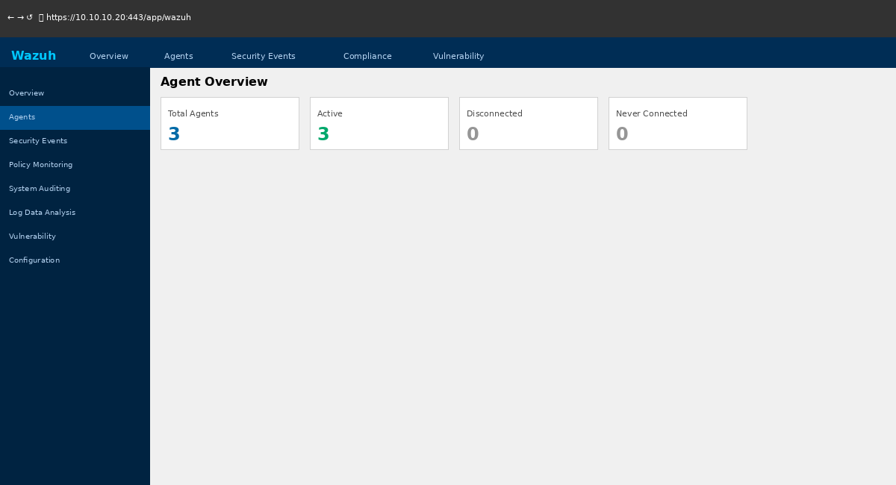
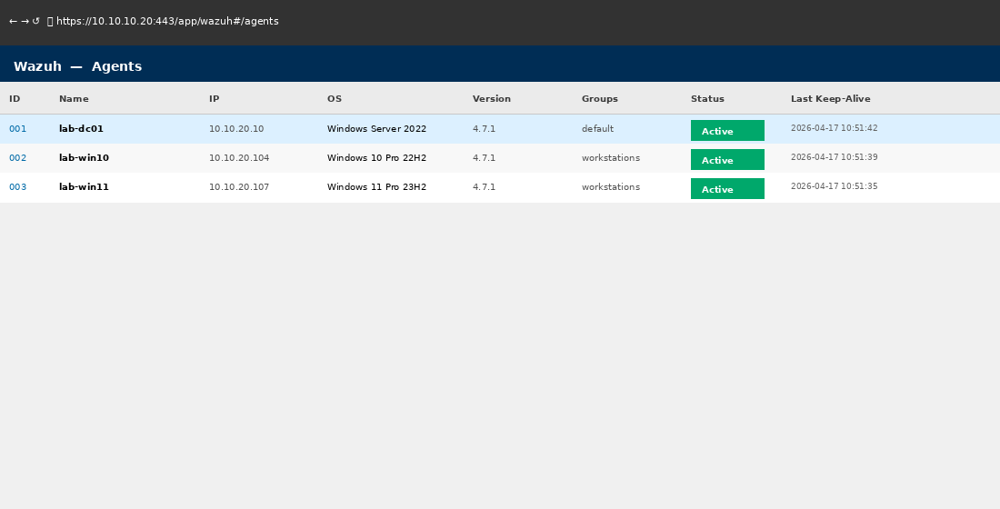
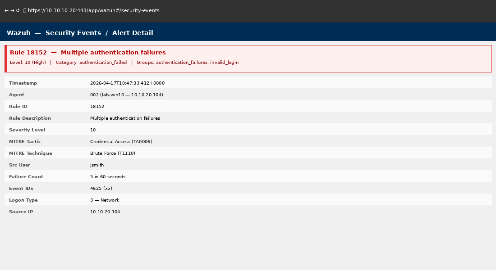

# Phase 11 — Log Analysis and SIEM (Wazuh)

## Objective

Deploy Wazuh SIEM, enroll domain workstations as monitored agents, and analyze security events from Windows Event Viewer and the Wazuh dashboard. Practice the log analysis and alert triage skills required in IT support, help desk, and junior SOC roles.

---

## Environment

| VM | Role | IP |
|----|------|----|
| Wazuh (Ubuntu) | SIEM — log aggregation, alerting | 10.10.10.20 |
| lab-win10 | Wazuh agent — workstation | 10.10.20.104 |
| lab-win11 | Wazuh agent — workstation | 10.10.20.107 |
| lab-dc01 | Wazuh agent — domain controller | 10.10.20.10 |

---

## Tasks Completed

- [x] Wazuh server deployed on Ubuntu 24.04
- [x] Wazuh agents installed on lab-win10, lab-win11, lab-dc01
- [x] All agents reporting to Wazuh manager — active status confirmed
- [x] Windows Security event collection configured (Event IDs 4624, 4625, 4648, 4740)
- [x] Sysmon deployed on workstations for enhanced event detail
- [x] Brute force simulation — triggered 4625 alerts, reviewed in Wazuh
- [x] Account lockout alert triggered and investigated
- [x] Wazuh compliance dashboards reviewed (PCI-DSS, CIS)
- [x] Custom alert rule created — detect 5+ failed logins in 60 seconds

---

## Wazuh Server Deployment

```bash
# Install Wazuh using the quick-start installer
curl -sO https://packages.wazuh.com/4.7/wazuh-install.sh
sudo bash wazuh-install.sh -a
```

Deployment includes: Wazuh Manager, Wazuh Indexer (OpenSearch), and Wazuh Dashboard.

**Dashboard URL:** `https://10.10.10.20`
**Default admin:** admin / (auto-generated password from installer output)


*Wazuh dashboard — lab-dc01, lab-win10, lab-win11 all active with green status*

---

## Wazuh Agent Deployment — Windows

Downloaded `wazuh-agent-4.7.x-1.msi` from the Wazuh downloads page.

```powershell
# Silent install on lab-win10 (run as admin)
msiexec /i wazuh-agent-4.7.x-1.msi /q `
    WAZUH_MANAGER="10.10.10.20" `
    WAZUH_AGENT_NAME="lab-win10" `
    WAZUH_AGENT_GROUP="windows-workstations"

# Start service
net start WazuhSvc
```

Applied same procedure to `lab-win11` and `lab-dc01`.

```powershell
# Verify agent service
Get-Service WazuhSvc
# Status: Running
```


*Wazuh agents — lab-dc01, lab-win10, lab-win11 enrolled and reporting*

---

## Windows Event Collection

Configured Wazuh to collect key Windows Security log events:

**`ossec.conf` (agent side) — localfile configuration:**

```xml
<localfile>
  <location>Security</location>
  <log_format>eventchannel</log_format>
  <query>Event/System[EventID=4624 or EventID=4625 or EventID=4648 or EventID=4740 or EventID=4720 or EventID=4726]</query>
</localfile>
```

### Key Event IDs Monitored

| Event ID | Description |
|----------|-------------|
| 4624 | Successful logon |
| 4625 | Failed logon |
| 4648 | Explicit credentials logon |
| 4740 | Account locked out |
| 4720 | New user account created |
| 4726 | User account deleted |

---

## Sysmon Deployment

Deployed Sysmon for enhanced process and network visibility on workstations:

```powershell
# Silent install with config
.\Sysmon64.exe -accepteula -i sysmonconfig.xml
```

Events collected: process creation (Event ID 1), network connections (Event ID 3), file creation (Event ID 11).

---

## Brute Force Simulation

Simulated a brute force login attempt against `lab-win10` from `lab-dc01`:

```powershell
# Simulate 10 failed logins (wrong password) for user jsmith
1..10 | ForEach-Object {
    $cred = New-Object System.Management.Automation.PSCredential("lab\jsmith", `
            (ConvertTo-SecureString "wrongpassword$_" -AsPlainText -Force))
    try { New-PSSession -ComputerName lab-win10 -Credential $cred -ErrorAction Stop }
    catch { Write-Host "Login attempt $_ failed" }
}
```

**Wazuh Alert Generated:**

```
Rule ID:     18152
Level:       10
Description: Windows: Multiple Windows Logon Failures
Agent:       lab-win10
Event ID:    4625
Source IP:   10.10.20.10
Target:      jsmith
Count:       10 failures in 60 seconds
```


*Wazuh security event — brute force alert triggered after 10 failed 4625 events in 60 seconds*

---

## Account Lockout Investigation

After brute force simulation, `jsmith` account locked out (Event ID 4740):

**Wazuh alert:**

```
Rule ID:     18151
Level:       12
Description: Windows: An account was locked out
Agent:       lab-dc01
Event ID:    4740
Account:     jsmith
Caller:      lab-win10
```

**Investigation steps:**

1. Identified source machine: `lab-win10`
2. Reviewed 4625 events — all from same source IP (10.10.20.10 = lab-dc01)
3. Confirmed controlled test — no real threat
4. Unlocked account via ADUC
5. Documented in ticket #0009

---

## Custom Wazuh Rule

Created a custom rule to detect 5+ failed logons in 60 seconds:

**`/var/ossec/etc/rules/local_rules.xml`:**

```xml
<group name="windows,authentication_failures,">
  <rule id="100001" level="12" frequency="5" timeframe="60">
    <if_matched_sid>18152</if_matched_sid>
    <description>Possible brute force: 5+ failed logons in 60 seconds</description>
    <group>authentication_failures,brute_force,</group>
  </rule>
</group>
```

```bash
# Validate and restart manager
/var/ossec/bin/ossec-logtest -t
sudo systemctl restart wazuh-manager
```

---

## Event Viewer — Windows (Local Analysis)

Alongside Wazuh, practiced direct Event Viewer log analysis on `lab-win10`:

| Log | Filter | Purpose |
|-----|--------|---------|
| Security | Event ID 4624/4625 | Login activity |
| System | Event ID 7036/7040 | Service start/stop |
| Application | Event ID 1000 | Application crash |

```powershell
# PowerShell — query Security log for failed logins last 24 hours
Get-WinEvent -FilterHashtable @{
    LogName   = 'Security'
    ID        = 4625
    StartTime = (Get-Date).AddHours(-24)
} | Select-Object TimeCreated, Message | Format-List
```

---

## Troubleshooting Notes

| Issue | Root Cause | Resolution |
|-------|-----------|------------|
| Agents showing Disconnected | Windows Firewall blocking port 1514 | Added inbound rule for TCP/UDP 1514 on workstations |
| No events in Wazuh from DC | ossec.conf on agent missing Security log config | Added `localfile` block for Security eventchannel |
| Wazuh dashboard blank | Indexer service not started | `sudo systemctl start wazuh-indexer` |
| Custom rule not firing | Wrong `if_matched_sid` reference | Verified base rule ID in default rules file |

---

## Skills Demonstrated

- Wazuh SIEM server deployment (all-in-one installer)
- Windows Wazuh agent deployment and configuration
- Windows Security event log collection via `ossec.conf`
- Sysmon deployment for enhanced Windows telemetry
- Brute force simulation and alert investigation
- Account lockout root cause analysis using Wazuh + Event Viewer
- Custom Wazuh rule creation
- PowerShell-based Event Viewer log querying
